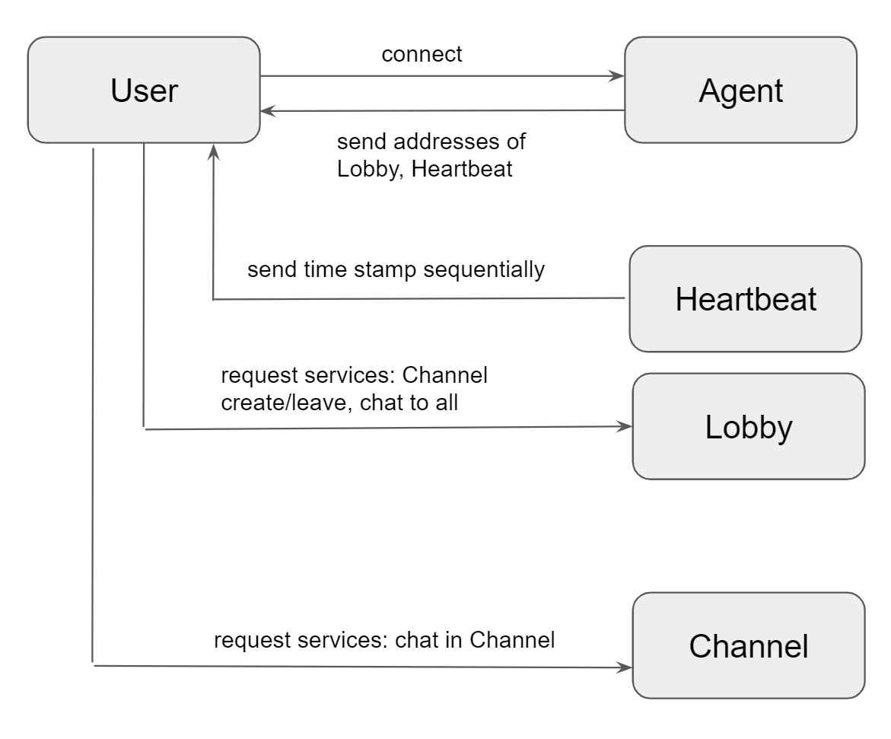
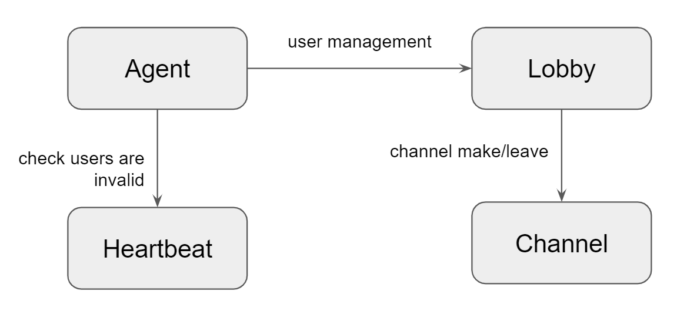

Chatting cilent/server with python and grpc

https://grpc.io/

# install

python 3.8.5 <=
```
$ pip install -r requirements.txt
```

# run

* server
```
$ python -m server
```
* client
```
$ python console.py
my index is 1
Help: /?    
```
* unit tests
```
$ pytest test.py
```

# guide

1. make a channel
```
>  /make
channel is created:localhost:50054
user 1 joined at channel 50054
```
2. leave from channel
```
> /leave 
You left from channel localhost:50054
```
3. list channels
```
> /list
channel:50054
```
4. join a channel
```
> /join 50054
You entered in a channel
```
5. list users
```
> /user
user:1 at channel 50054
user:3 at channel 0
```
6. chat to all
```
>/all Hi, there! 
```
7. help
```
> /?
/all: send chat to all
/make: make a channel
/list: list up all channels
/join: join to channel
/leave: leave from the channel
/user: list users in the channel or lobby
/?: list up all commands
```

# implementation

* an user connect at Agent first
* agent sends addresses of Heartbeat and Lobby to user
* Heartbeat send time stamp to user sequentially
* Lobby supports various services relating chatting
  * When an user requests to open channel, Lobby create a new Channel and then send whose address
  * User can chat in public with Lobby
  * User can chat with other users in Channel



